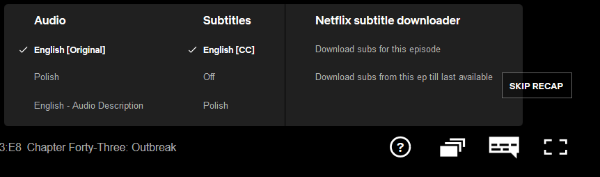

# netflix-to-srt
1. Get the subtitles from Netflix (`.xml` dfxp or `.vtt` files), YouTube or other sources.
2. Convert them into `.srt`
## Get the subtitles
### From Netflix
- Install [Tampermonkey](https://chrome.google.com/webstore/detail/tampermonkey/dhdgffkkebhmkfjojejmpbldmpobfkfo)

- Install [Netflix - subtitle downloader](https://greasyfork.org/en/scripts/26654-netflix-subtitle-downloader) to Tampermonkey

- Play video on Netflix and download subtitles using the tool

  

### From YouTube

- Use [youtube-dl](https://github.com/ytdl-org/youtube-dl) (available for Windows, Mac and Linux) to download
- Related tags:

  ```
  --write-sub                      Write subtitle file
  --write-auto-sub                 Write automatic subtitle file (YouTube only)
  --all-subs                       Download all the available subtitles of the video
  --list-subs                      List all available subtitles for the video
  --sub-format FORMAT              Subtitle format, accepts formats preference, for example: "srt" or "ass/srt/best"
  --sub-lang LANGS                 Languages of the subtitles to download (optional) separated by commas, use IETF language tags like 'en,pt'
  --skip-download                  Do not download the video
  ```

- For example, to download all subs from a YouTube URL and skip downloading the video

  ```
  youtube-dl --all-subs --skip-download https://www.youtube.com/watch?v=VHNfvFOBC0A
  ```

## Convert them into .srt

```
python main.py [-i INPUT_FOLDER] [-o OUTPUT_FOLDER]
```

By default, both `INPUT_FOLDER` and `OUTPUT_FOLDER` will be the current directory.

## Note:
In no way I am encouraging any kind of illegal activity. Please know your local laws and ask for written permissions from content owners (e.g. Netflix, YouTube) when necessary.
